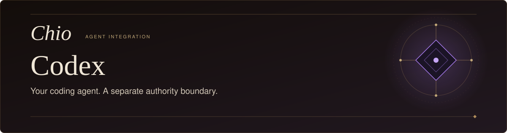
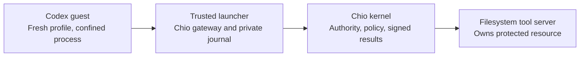

<p align="center">
  <picture>
    <source media="(max-width: 600px)" srcset="docs/assets/readme-hero-mobile.svg" />
    
  </picture>
</p>

<p align="center">
  <strong>Kernel-owned file work for Codex.</strong>
</p>

<p align="center">
  <a href="#build-from-source">Build</a>&nbsp;&nbsp;&middot;&nbsp;&nbsp;
  <a href="#run-a-scoped-file-task">Run</a>&nbsp;&nbsp;&middot;&nbsp;&nbsp;
  <a href="#the-execution-boundary">Boundary</a>&nbsp;&nbsp;&middot;&nbsp;&nbsp;
  <a href="#ordinary-codex-hooks">Hooks</a>&nbsp;&nbsp;&middot;&nbsp;&nbsp;
  <a href="#recovery-and-operation">Recovery</a>&nbsp;&nbsp;&middot;&nbsp;&nbsp;
  <a href="#development">Development</a>
</p>

[Chio](https://github.com/backbay-labs/chio) gives Codex scoped access to file
tools executed by the kernel. This repository supplies a restricted launcher
that separates the agent from the protected resource, keeps operator credentials
outside the guest, and verifies results before acknowledging delivery. It also
ships ordinary Codex hooks for policy diagnostics and receipt collection.

> **Restricted-mode candidate:** macOS arm64, Codex CLI **0.153.4**, model
> **gpt-5.5**. [Bounded real-host evidence](docs/STATIC-KERNEL-QUALIFICATION.md)
> records useful work, prevention and recovery on exact artifacts. Full I01-I08
> acceptance and compatible published delivery remain open.

## Build from source

Use Node.js 22 or newer, npm and Git. The pinned Chio bridge is included in the
repository; the build needs no private sibling checkout.

```sh
git clone https://github.com/backbay-labs/chio-codex-plugin.git
cd chio-codex-plugin
npm ci --ignore-scripts --no-audit --no-fund
npm run build
node ./dist/cli/main.js --help
```

This builds the CLI and prints its commands. Protected execution additionally
requires the pinned native Codex binary, a compatible running kernel and an
operator-owned resource setup.

## Run a scoped file task

Start with the [operator setup](RESTRICTED.md#operator-configuration-and-run):
the kernel owns the filesystem tool server, and the agent has no direct mount
or Docker access. The restricted launcher requires a loopback IPv4 kernel
endpoint and delegated session authority. The original public kernel CLI 0.1.0
does not provide the qualified version combination.

Prepare the private request described in that guide, then run from the built
checkout. Replace the absolute paths below with your operator-owned files and a
new evidence directory:

```sh
node ./dist/cli/main.js prepare-gateway \
  /absolute/private/request.json \
  /absolute/private/gateway.json

node ./dist/cli/main.js restricted \
  --gateway-config /absolute/private/gateway.json \
  --model-auth-file /absolute/private/codex/auth.json \
  --evidence-dir /absolute/evidence/new-run \
  --prompt 'Use Chio to write /workspace/example.txt with "hello from Codex", then read it back.'
```

The example uses a [designated native ChatGPT login](RESTRICTED.md#existing-chatgpt-subscription-login).
Keep its cache owned by the operator, mode `0600`, outside the checkout and guest
trees. API authentication is also supported through `--model-key-file` or
`OPENAI_API_KEY`. The launcher verifies the Codex executable's version and digest;
use `--codex-binary` to select its path explicitly.

`/workspace/example.txt` belongs to the kernel's resource container. The launcher
retains native events in `stdout.jsonl` and records the host exit separately from
the protected execution outcome in `launch.json`. A finished model turn alone
does not establish that the requested file work completed.

## The execution boundary



The supported workflow consists of `read_text_file`, `write_file`, `edit_file`
and `list_directory`, with approval resume when configured. The launcher disables
native shell, delegation, arbitrary plugins/MCP servers, browser/computer tools
and hosted web search. Native `apply_patch` remains visible, but its read-only
effect boundary blocks writes. User configuration cannot add an alternate route
to the protected resource in this mode.

Resource ownership is part of the contract. Mounting the protected files into the
guest or enabling a shell or second MCP server changes that boundary. See the
[restricted-mode contract](RESTRICTED.md#resource-boundary) for the exact scope.

## Ordinary Codex hooks

The [.codex-plugin manifest](.codex-plugin/plugin.json), [hooks](hooks.json) and
[skills](skills/) support policy diagnostics in ordinary Codex sessions.
`chio-codex run` passes policy/session settings to Codex; it does not create the
restricted launcher or ensure hooks run. Real host tests observed file effects
when hooks were omitted, crashed or failed. A hook precheck cannot serve as the
resource's enforcement boundary.

The [hook reference](docs/HOOKS.md) covers trust, isolated state, diagnostic
commands, host-contract probes and removal. Those probes remain separate from
kernel integration acceptance.

## Recovery and operation

An unknown protected outcome keeps the original authority fenced. Preserve the
private gateway configuration, journal and resource evidence; reconcile the
original operation before another dispatch. A new model conversation, renewed
login or deleted journal is not recovery.

- [Operator recovery, approvals and upgrades](RESTRICTED.md#recovery-and-upgrades)
- [Native login and renewal](RESTRICTED.md#existing-chatgpt-subscription-login)
- [Exact artifact and native-test record](docs/STATIC-KERNEL-QUALIFICATION.md)
- [Package qualification and release procedures](docs/RELEASE-QUALIFICATION.md)

## Development

```sh
npm test
npm run typecheck
npm run pack:release -- /absolute/new-artifact-directory
```

The pack command builds a staged tarball with production dependencies included.
Direct `npm pack` intentionally refuses an unbundled package. Follow the
[clean consumer procedure](docs/RELEASE-QUALIFICATION.md#local-qualification)
to install and inspect the emitted artifact. A source build or passing component
suite does not replace real-host qualification of that exact kernel/plugin set.

[Apache-2.0](LICENSE).
